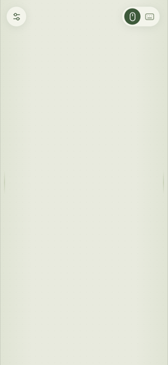

# SofaPad

**你的 iPhone 浏览器，就是 Mac 的触控板。坐在沙发上就能用。**

把手机浏览器变成连着电视的 Mac 的整屏触控板和文字输入端。只需要在 Mac 上装一个菜单栏 App——网页和服务都内置在 App 里，**手机端什么都不用装**，没有云服务。

> 当前版本 **0.9.3** · 产品基线 [v2.5](docs/product-blueprint.md) · 自动验证 99 项全绿，详见 [验证记录](docs/validation.md)



## 快速开始

1. **安装**：双击 `SofaPad-<版本>.pkg`，装到「应用程序」，然后打开它（没有窗口，只在菜单栏出现一个小图标）。
2. **授权**：菜单栏图标 → 「授予辅助功能权限…」，在 系统设置 → 隐私与安全性 → 辅助功能 里打开 SofaPad。
3. **连接**：手机连同一个 Wi‑Fi，用浏览器打开菜单栏里显示的地址（推荐 `http://<Mac 名>.local:9876/`），看到整屏触控板就能控制了。

完整的安装、手势、输入、设置与排障说明见 **[安装与使用教程](docs/installation.md)**。

## 它能做什么

- **整屏触控**：单指移动／点击／双击，双指右击／滚动，三指拖动；轻点一次后按住稍停再滑动即为按住拖动；长按约半秒右击。左上角设置手感，右上角是简约的鼠标／键盘图标切换。
- **边缘滚动**：左右各 28 px 窄条落指即滚动，其外 48 px 的渐隐带（合计 76 px）内纵向滑动同样滚动；横向滑动仍是移动指针。起手后锁定区域，跨区不误切换。
- **手机输入**：输入框是「穿堂」式——手机键盘选词后字符立即出现在 Mac 光标处并从手机上消失；删除显示 ⌫、回车显示 ↵ 并发送一次真正的 Return；语音听写停顿即发送。不经过剪贴板，不抢焦点，也不读取 Mac 上已有的文字。
- **多台设备同时控制**：任何数量、任何设备（手机／平板／电脑）打开地址即可；同一时刻以先开始的手势为准，菜单可单个或一次性断开全部控制者。
- **开箱即用**：App 启动服务就开着，菜单栏显示固定 `.local` 名字与当前 IP 两个地址；支持登录时启动，不联网、不遥测、不自动更新。

手感默认值：指针与拖动 **1.5×**、滚动 **0.3×**；两个滑块的中点是默认值，两边都能细调。

## 系统要求与边界

- macOS 13+（本仓库提供 Apple Silicon 安装包，Intel 需自行构建）、手机与 Mac 在同一局域网、Mac 已登录解锁并保持唤醒。
- 服务在选定私有 IPv4 上提供**明文 HTTP/WS**，打开地址即可控制，没有账号或配对——请只在可信家庭网络使用，不要映射到公网。
- 长按与边缘滚动手感、三指系统手势、iOS 输入法与电视实际操作仍需真机验收；没有屏幕镜像、远程开机／解锁或媒体键。

## 文档

- [安装与使用教程](docs/installation.md)：安装、授权、连接、手势、输入、设置、排障、更新与卸载。
- [统一产品文档](docs/product-blueprint.md)：产品范围、交互、边界与验收标准。
- [能力评估与调整](docs/decisions.md)：冲突处理与实现映射。
- [协议 v2](Protocol/README.md)：消息格式、去重与状态约束。
- [验证记录](docs/validation.md) · [后续任务](docs/roadmap.md) · [文档索引与历史](docs/README.md)。

## 本地构建

需要 macOS、Xcode（Swift 6.2+）、Node.js 22+ 和 pnpm。当前验证环境为 Apple Silicon / macOS 26.6.2 / Xcode 26.6 / Swift 6.3.3。

```bash
pnpm install --dir Web --frozen-lockfile
bash scripts/build.sh          # 生成 build/SofaPad.app
open build/SofaPad.app
bash scripts/test.sh           # 网页、Swift 与回环集成测试
bash scripts/package.sh        # 生成 .pkg / .zip（MAKE_DMG=0 跳过 .dmg）
```

输出当前主机架构的 `build/SofaPad.app`，默认本机 ad hoc 签名；网页、图标与第三方许可自动打包，最终使用者不需要 Node。自己用直接复制即可：`ditto build/SofaPad.app /Applications/SofaPad.app`。Developer ID／公证／公开分发尚未完成。

## License

[MIT](LICENSE) · Copyright (c) 2026 Key (keyzhao0118)。[第三方许可与致谢](docs/third-party-notices.md) 随 App 保留。
