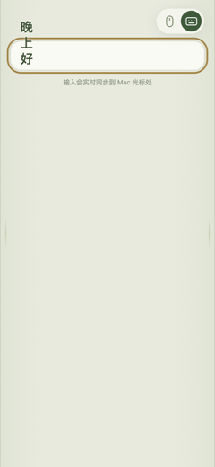
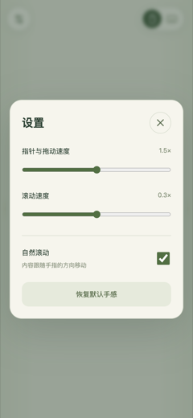

# 安装与使用教程

从零开始的完整教程：装好 Mac 端的 App、授权、用手机连上、上手手势与输入。开发者内容（从源码构建、测试、打包）在 [最后一节](#13-从源码构建测试与打包)。


SofaPad 只有一个 Mac 菜单栏 App，网页和服务都内置。**手机端什么都不用装**：同一个 Wi‑Fi 下用浏览器打开菜单栏显示的地址即可控制。

## 目录

1. [准备](#1-准备)
2. [安装 Mac App](#2-安装-mac-app)
3. [授予辅助功能权限（一次性）](#3-授予辅助功能权限一次性)
4. [手机连接](#4-手机连接)
5. [手势速查](#5-手势速查)
6. [在 Mac 上输入文字](#6-在-mac-上输入文字)
7. [手感设置](#7-手感设置)
8. [菜单栏菜单](#8-菜单栏菜单)
9. [多台设备同时控制](#9-多台设备同时控制)
10. [常见问题](#10-常见问题)
11. [更新与卸载](#11-更新与卸载)
12. [安全边界](#12-安全边界)
13. [从源码构建、测试与打包](#13-从源码构建测试与打包)

## 1. 准备

| 项目 | 要求 |
| --- | --- |
| Mac | macOS 13 或更新；本仓库提供 Apple Silicon（arm64）安装包，Intel 机器需要自己构建。已登录并解锁，控制期间保持唤醒 |
| 手机／平板 | 与 Mac 在**同一个 Wi‑Fi**；Safari、Chrome 等任意现代浏览器，不需要安装任何手机 App |
| 网络 | 家用路由器；不要用访客网络或开启了「客户端隔离」的 Wi‑Fi，那样两台设备互相不可见 |
| 权限 | 辅助功能（必需，见第 3 节）；登录时启动（可选） |

## 2. 安装 Mac App

1. 拿到 `SofaPad-<版本>.pkg`（自己构建见第 13 节）。
2. **双击安装**，输入管理员密码。App 会装到「应用程序」。
3. **打开 SofaPad**。它没有窗口、也不出现在 Dock 里，只在菜单栏出现一个小图标——这是正常的，所有功能都在菜单里。

安装时的常见提示：

| 提示 | 处理 |
| --- | --- |
| 「Apple 无法检查是否包含恶意软件」 | 右键（或 Control＋点击）App／安装包 → 「打开」；或到 系统设置 → 隐私与安全性 → 点「仍要打开」 |
| 安装包是从网上下载／AirDrop 来的，双击没反应 | 执行 `xattr -dr com.apple.quarantine <文件路径>` 后重试；U 盘拷贝通常没有这个标记 |
| 只有 `.zip` 压缩包 | 解压后把 `SofaPad.app` 拖进「应用程序」，首次打开同样用右键「打开」 |

装到别的位置（例如只解压到下载目录）也能用，但放在「应用程序」里更稳定：位置和签名不变化时，辅助功能授权不会反复失效，「登录时启动」也才能正常工作。

## 3. 授予辅助功能权限（一次性）

SofaPad 要在 Mac 上生成鼠标和键盘事件，必须拿到这一项权限。

1. 点菜单栏图标 → 「**授予辅助功能权限…**」（启动时系统一般也会自动弹一次提示）。
2. 在 系统设置 → 隐私与安全性 → **辅助功能** 里打开 SofaPad 的开关。
3. 回到菜单，菜单里不再显示这一项、状态变成「等待手机连接」就成功了。

- 不需要录屏、输入监控、完全磁盘访问等任何其他权限。
- 重装 App 或换了存放目录后，系统里可能残留旧的授权条目：先在列表里用 − 移除旧条目，再重新添加。
- 断网也能用：所有数据都在本机，没有云服务，也不上传任何内容。

## 4. 手机连接

1. 确认手机连的是**与 Mac 同一个 Wi‑Fi**。
2. 点菜单栏图标，菜单里会显示两个地址：
   - `http://<Mac 名>.local:9876/` —— **推荐长期用这个**，路由器换 IP 也不变；
   - `http://192.168.x.x:9876/` —— 当前 IP，网络拦截多播（mDNS）时用这个。
3. **在手机浏览器里打开其中一个地址**。页面出现整屏触控板并显示「可以开始操作」，就可以控制了。

补充说明：

- 服务**随 App 启动自动开启**，不需要点「开启服务」；App 没退出就一直可用。
- 想在手机上像 App 一样全屏：Safari 里点分享 → 「添加到主屏幕」。
- 地址打不开时见 [第 10 节](#10-常见问题)；换成别的手机、平板或电脑浏览器，同样直接打开这个地址即可。

## 5. 手势速查

手机屏幕上整块都是触控板，没有边界，也没有需要瞄准的按钮。

| 手指动作 | 效果 |
| --- | --- |
| 单指移动 | 移动 Mac 指针 |
| 单指轻点 | 左键单击 |
| 单指快速双击 | 左键双击 |
| 单指按住约 0.5 秒 | 右键单击 |
| 双指轻点 | 右键单击 |
| 双指上下滑动 | 滚动 |
| **左右边缘 76 px 内单指上下滑** | 滚动（不必正好压在最边上） |
| 三指滑动 | 拖动（拖窗口、选文字） |
| 轻点一次 → 按住**稍停一下** → 滑动 | 按住拖动（拖窗口、滑杆、选区） |

细节与技巧：

- **长距离移动指针**：手指抬起再按下继续滑，反复滑即可。只有「轻点一次、再按住稍停、然后滑动」才会被当成拖动，所以连续滑动不会被误判。
- **边缘滚动**：最外侧 28 px 落指即可滚动；再往里的 48 px（合计 76 px，正好是屏幕上渐隐提示的宽度）里，纵向多于横向的滑动同样滚动，横向滑动仍是移动指针。拇指不用刻意贴边，起手时几像素的横向抖动也不影响判定。滚动时对应一侧的渐隐标记会加深。
- **拖动中**：先松开的那一方决定结束；中途加入第二根手指会取消当前手势。
- **三指系统手势**：iOS 自带的三指撤销／粘贴可能抢占，遇到时改用「双指滚动」或「轻点后按住拖动」。
- 滚动速度与指针速度都能调，见下一节。

## 6. 在 Mac 上输入文字



1. **先在 Mac 上点好要输入的位置**（把光标放进目标输入框），SofaPad 不会自动寻找输入框。
2. 在手机上点右上角的**键盘图标**，输入面板从顶部下拉，手机键盘从底部升起。
3. 正常输入即可：

| 操作 | 表现 |
| --- | --- |
| 中文／Emoji 选词 | 选定的字**立即出现在 Mac 光标处**，同时从手机输入框消失、向上飘出淡出 |
| 删除 | 显示 ⌫，Mac 上按一次退格；拼音纠错只动手机上的候选串，不会误删 Mac 的内容 |
| 回车 | 显示 ↵，发送一次**真正的 Return 按键**——换行、确认还是提交由 Mac 上的那个应用决定 |
| 语音听写 | 说话停顿约 1.2 秒或结束听写时才发送，识别的改动只影响还没发出的部分 |
| 收起键盘 | 点输入面板以外的任何地方，或手机键盘的完成键，都会收起面板回到触控板 |

- 手机上**不会显示 Mac 上已有的文字**：输入框始终是空的临时草稿。
- 断线、切后台或未授权时输入框只读，重连后从空框开始，不会重放断线期间的内容。
- 连接的是旧版 Mac App 时，会退回「贴入输入框」整段粘贴 + 退格按钮，功能较少但可用。

## 7. 手感设置



点左上角齿轮打开设置：

- **指针与拖动速度**：默认 **1.5×**，可调 0.2–5.0。
- **滚动速度**：默认 **0.3×**，可调 0.05–5.0。
- **自然滚动**：内容跟随手指方向移动（与 Mac 触控板一致）；关掉则反向。
- **恢复默认手感**：回到 1.5× / 0.3× / 自然滚动。

两个滑块的**中点就是默认值**：往左更慢、往右更快，两侧刻度一样细，所以默认值两边都能微调。设置保存在手机浏览器里；换手机或清除浏览器数据会回到默认。

## 8. 菜单栏菜单

点菜单栏图标，从上到下：

| 菜单项 | 说明 |
| --- | --- |
| 状态 | 「等待手机连接」／「<设备名> 正在控制」／「N 台设备正在控制」／「服务已关闭」／「正在等待网络…」 |
| 地址 | 依次显示 `.local` 名与当前 IP 两个地址，用手机浏览器打开即可 |
| 停止服务／开启服务 | 手动开关。主动停止后保持关闭，直到再次开启或重启 App |
| 断开当前控制者／断开全部控制者 | 只在有设备连接时出现，用来立刻收回控制权 |
| 授予辅助功能权限… | 未授权时出现，点它跳到系统设置 |
| 网络地址 | 有多块网卡（例如 Wi‑Fi＋有线）时可选绑定的地址 |
| 登录时启动 | 开机自动运行。若开机时网络还没就绪，菜单显示「正在等待网络…」，地址一出现就自动开启 |
| 版本号 | 例如 `0.9.3 · 触控与文字粘贴 · 无云服务` |
| 退出 SofaPad | 退出前会释放按住的按键 |

## 9. 多台设备同时控制

- **任何数量**的设备都能同时连接：手机、平板、另一台电脑，打开同一个地址即可。菜单会显示「N 台设备正在控制」。
- 同一时刻以**先开始的那个手势**为准：其他设备的移动、点击、滚动会被忽略，直到这个手势结束。
- 只有按住指针的那台设备断开时，才会释放被按住的键（不会留下卡住的拖动）。
- 想收回控制权：菜单里「断开当前控制者」或「断开全部控制者」。

## 10. 常见问题

| 现象 | 处理 |
| --- | --- |
| 菜单里显示「正在等待网络…」 | Mac 还没拿到私有 IP：检查 Wi‑Fi／网线；IPv6-only、VPN、特殊网桥暂不支持 |
| 手机打不开地址 | 确认手机与 Mac 在同一 Wi‑Fi、App 在运行、Mac 未睡眠；关掉访客网络／客户端隔离；防火墙若拦截，允许 SofaPad 接受传入连接 |
| `.local` 地址打不开 | 该网络拦了多播：改用菜单里的 IP 地址，或在路由器给 Mac 保留固定 IP |
| 页面能打开但操作没反应 | 检查辅助功能权限（第 3 节）；Mac 是否处于锁屏／睡眠；页面右上角是否显示异常提示 |
| 点开了「重新连接」仍然不动 | Mac 端菜单显示「服务已关闭」时，点「开启服务」 |
| 边缘滑动时好时坏 | 现在 76 px 判定带内纵向滑动都算滚动，横向滑动仍是移动指针；若仍不灵，确认没有第二根手指同时压着屏幕 |
| 想要的移动变成了拖动 | 拖动需要「轻点一次 → 按住稍停 → 滑动」；连续滑动移动指针时不要在按下后停顿太久 |
| 回车没有提交表单 | SofaPad 只发送一次真正的 Return；是否提交由 Mac 上的应用决定（有的应用需要点按钮） |
| 输入的字没出现在 Mac 上 | 确认 Mac 上光标在可输入的位置；剪贴板类应用、部分密码框会拒绝输入 |
| 地址变了 | 路由器换了租约：用 `.local` 地址，或在路由器为 Mac 保留 DHCP 地址 |
| 更新后仍是旧界面 | 手机浏览器缓存：下拉刷新一次页面（页面本身是 no-store，一般刷新即可） |

## 11. 更新与卸载

**更新**（自己构建的分支）

```bash
git pull
pnpm install --dir Web --frozen-lockfile
bash scripts/build.sh          # 重新构建 App（旧版移到 build/previous.*/）
open build/SofaPad.app
```

先退出旧版再构建，然后把新的 `SofaPad.app` 覆盖到「应用程序」；需要安装包时用 `bash scripts/package.sh` 生成 `.pkg`（可选 `.dmg`）。手机端不需要更新，刷新页面即可。

**卸载**

1. 菜单栏菜单 → 退出 SofaPad；
2. 把 `/Applications/SofaPad.app` 拖进废纸篓；
3. 系统设置 → 通用 → 登录项，移除 SofaPad；
4. 系统设置 → 隐私与安全性 → 辅助功能，用 − 删除 SofaPad 条目；
5. （可选）删除 `~/Library/Application Support/SofaPad/`（只可能来自 0.7.0 之前的旧版本）。

## 12. 安全边界

- 服务只在**选定的私有 IPv4**上提供**明文 HTTP/WS**（默认端口 9876）：局域网内任何能访问该地址的人都能控制这台 Mac，也能读取流量。**请只在可信的家庭网络使用**，不要做端口映射到公网，也不要在上面传输敏感内容。
- 没有账号、配对码、二维码或证书：打开地址即可控制，这是有意为之的取舍。
- 仍然保留的防护：精确校验 Host 与 Origin（未绑定的主机名、跨站页面、DNS 重绑定请求会被拒绝）、POST／WS 必须同源、48 个连接上限、消息大小与频率限制。
- 不联网、不遥测、不自动更新；辅助功能权限只用于生成你手指产生的鼠标／键盘事件。

## 13. 从源码构建、测试与打包

需要 macOS、Xcode（Swift 6.2+）、Node.js 22+、pnpm。当前验证环境：Apple Silicon / macOS 26.6.2 / Xcode 26.6 / Swift 6.3.3；运行目标 macOS 13+，旧系统与 Intel 待测。

```bash
pnpm install --dir Web --frozen-lockfile
bash scripts/build.sh          # 生成 build/SofaPad.app（release，本机 ad hoc 签名）
bash scripts/test.sh           # 网页 + Swift + 回环集成测试
bash scripts/package.sh        # 生成 .pkg / .zip（MAKE_DMG=0 跳过 .dmg）
bash scripts/make-icon.sh      # 需要时重新生成 MacApp/AppIcon.icns
```

- `build.sh` 会先编译网页（`Web/dist`）再打包 App，网页、图标与第三方许可都已内置，**最终使用者不需要 Node**。
- 可用 `NODE_BINARY`／`PNPM_BINARY` 指定工具，`CONFIGURATION=debug` 切调试构建，`SIGNING_IDENTITY`／`PKG_SIGNING_IDENTITY` 使用自己的签名身份。
- 构建产物与旧版本备份都在 `build/`（已加入 `.metadata_never_index`，不进 Spotlight）；清理用 `rm -rf build/previous.* build/SofaPad-<旧版本>-*`。
- 受限环境（嵌套沙箱、部分 CI）里 SwiftPM 需要 `SWIFT_BUILD_FLAGS=--disable-sandbox`／`SWIFT_TEST_FLAGS=--disable-sandbox`；普通终端不需要。
- 测试全部在本机回环地址上跑，用假执行器，**不会操作真实鼠标、剪贴板或向用户应用投递事件**。可选的桌面浏览器回归需要 Playwright 与 Chrome：

```bash
PLAYWRIGHT_MODULE=/path/to/playwright-core/index.mjs node Tests/Integration/browser_test.mjs
```

- 本机演示（不操作系统输入）：

```bash
.build/debug/SofaPad --preview-server --port 19876 --web-root "$PWD/Web/dist" --info-file /tmp/sofapad-preview.json
```

正式分发需要自己的 Developer ID、Hardened Runtime、公证和真机验收；脚本支持 `SIGNING_IDENTITY`，流程见 [Apple 公证文档](https://developer.apple.com/documentation/security/notarizing-macos-software-before-distribution)。本机签名校验不等于分发验收。

控制面板与按钮屏蔽浏览器选中效果，输入框仍可选字、复制和粘贴。
